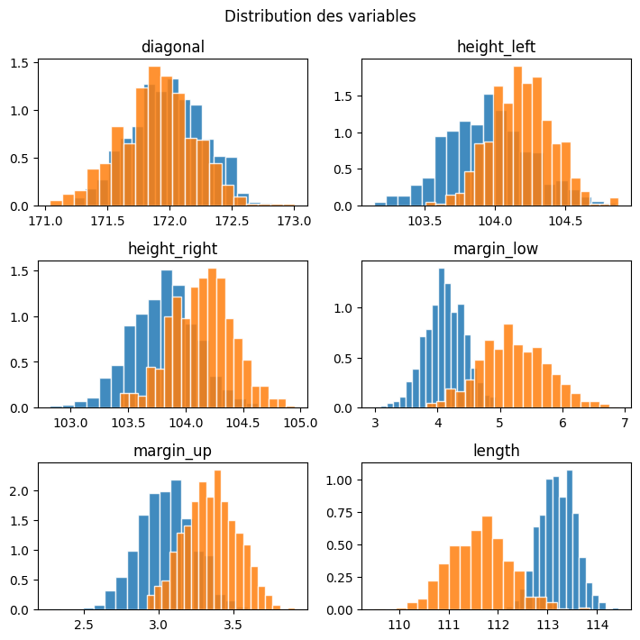
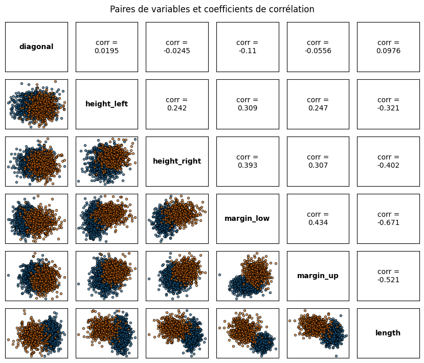
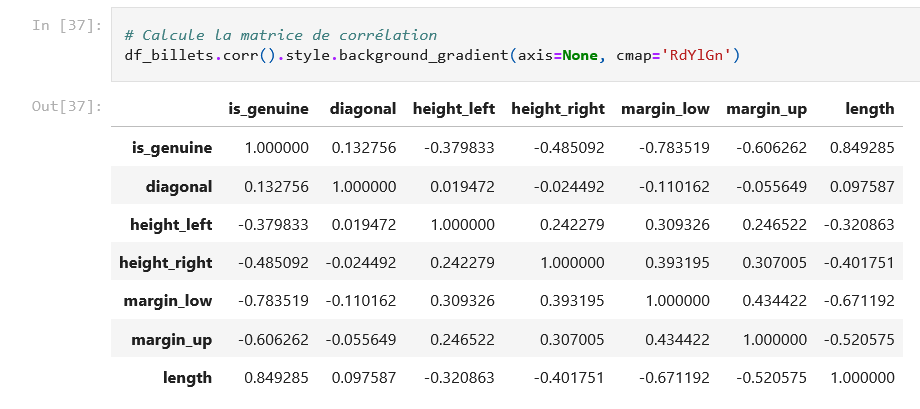
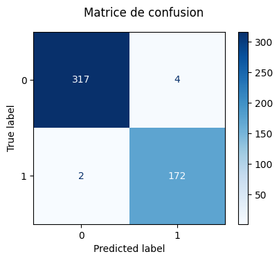
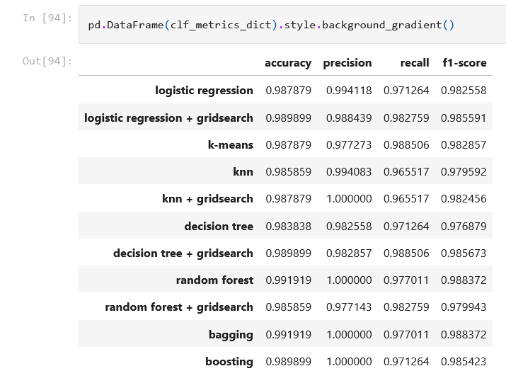
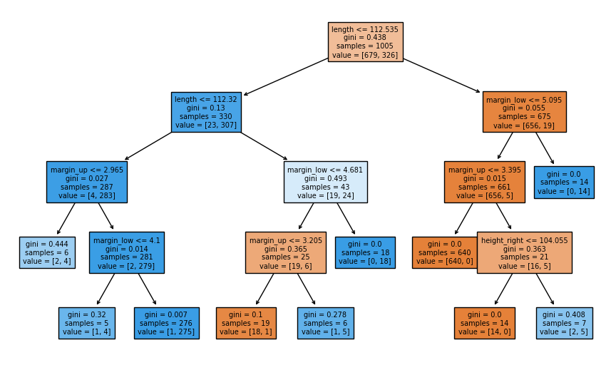
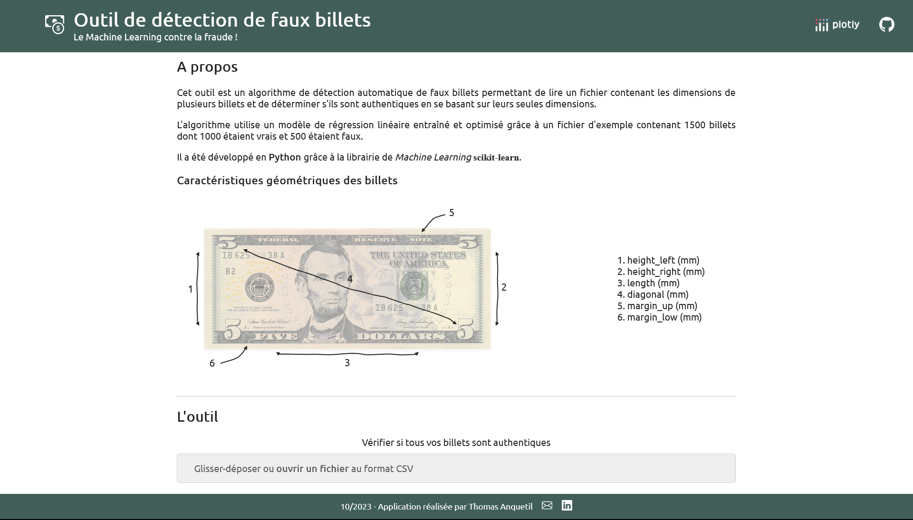

# Projet 10 : Détectez des faux billets avec Python

> ## &#9888; Déploiement de l'agorithme
> * Le code du déploiement de l'application Dash Plotly est disponible dans un le dépôt [`detection-faux-billets-dash-app`](https://github.com/anquetos/detection-faux-billets-dash-app.git).
> * L'application déployée sur [render](https://render.com/) est disponible [ici](https://detection-faux-billets-dash-app.onrender.com/).
>
> **J'utilise une version gratuite de l'application donc le chargement peut être un peu long.**

## &#128203; Scénario
En tant que consultant *Data Analyst* nous effectuons une prestation en régie au sein de l’**Organisation nationale de lutte contre le faux-monnayage (ONCFM)**. Cette institution a pour objectif de mettre en place des méthodes d’identification des contrefaçons des billets en euros.

## &#127919; Objectifs
* Préparer et analyser les données comprenant les caractéristiques dimensionnelles des billets en fonction de leur authenticité.
* Explorer différentes solutions pour la mise en place de l'algorithme et retenir le modèle le plus adapté.
* Tester notre algorithme sur de nouvelles données.

## &#128295; Outils utilisés
* **Pandas**, **Matplotlib** et **Seaborn** : préparation et analyse descriptive des données.
* **SciPy**, **scikit-learn** et **statsmodels**  : mise en de l'algorithme.
* **Joblib** et **Pathlib** : pour l'exportation de l'algorithme.
* **Dash Plotly** : pour le déploiement de l'algorithme sur une application en ligne.

## &#127891; Compétences acquises
* Réaliser une régression linéaire.
* Opérer des classifications automatiques pour partitionner les données.
* Réaliser une analyse prédictive.
* Réaliser une régression logistique.
* Réaliser une classification kNN et k-means.
* Réaliser un arbre de décision et une forêt aléatoire.
* Utiliser des méthodes ensemblistes (*Bagging* et *Boosting*).
* Optimiser un modèle avec `GridSearchCV`.
* Valider un modèle avec la validation croisée.

## Example d'analyses de classfications réalisées dans le *notebook* de préparation

## Aperçu de l'application Dash

