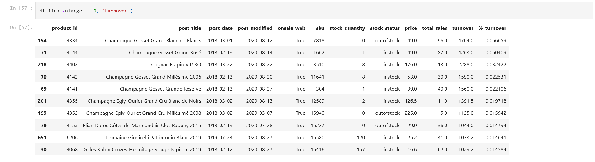
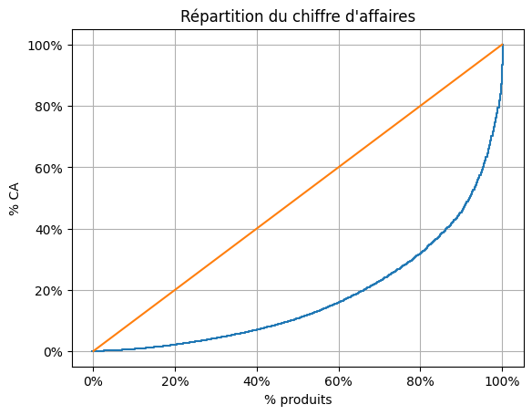

# Projet 5 : Optimiser la gestion des données d'une boutique

## &#128203; Scénario
Dans le cadre de ce projet, nous sommes *Data Analyst freelance* en mission chez BottleNeck, un marchand de vin très prestigieux.

## &#127919; Objectifs
Obtenir un jeu de données cohérent et complet à partir des fichiers qui nous ont été fournis puis étudier les ventes de la boutique en ligne. Il faudra également réaliser une étude univariée sur les prix de ventes des produits.

## &#128295; Outils utilisés
* **Pandas** : importation, préparation, nettoyage des données.
* **Pandas** et **Matplolib** : réalisation des analyses et visualisations.

## &#127891; Compétences acquises
* Gérer les erreurs et les incohérences présentes sur des données stockées.
* Classifier différents types de données.
* Réaliser une analyse univariée pour interpréter des données.

## Examples d'analyses réalisées dans le *notebook*

