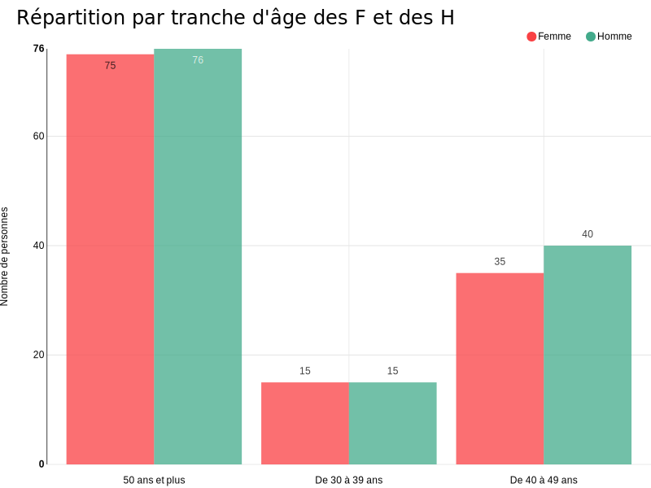
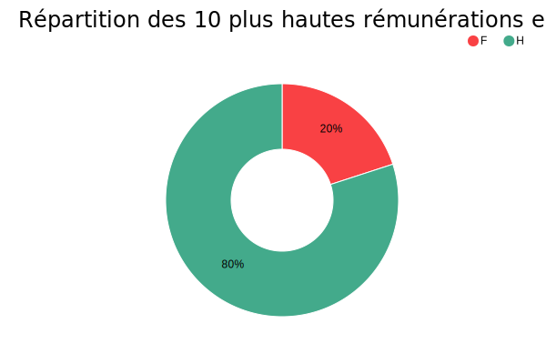
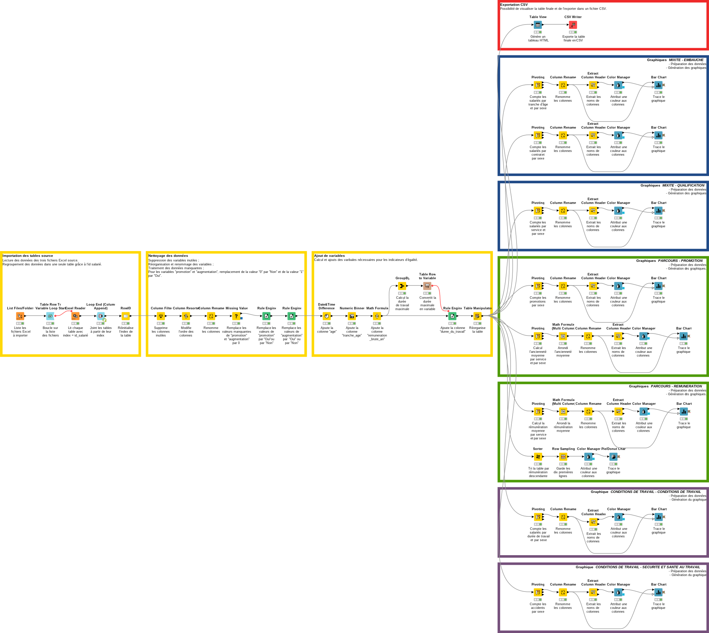

# Projet 7 : Analysez des indicateurs de l'égalité femme-homme avec Knime

## &#128203; Scénario
Nous sommes employé, en tant que *Data Analyst*, d'un cabinet de consultant spécialisé dans la transformation digitale des entreprises. Ce dernier compte déjà plus de 150 salariés et est en phase de croissance importante. Il souhaite afficher une politique volontariste pour le développement de l'égalité femme-homme au sein du cabinet.

## &#127919; Objectifs
Automatiser la création d'un rapport de diagnostic sur l'égalité professionnelle à partir des données du Système d’Informations des Ressources Humaines (SIRH) en utilisant le logiciel **Knime**. Il faut créer un *workflow* permettant d'importer et de préparer les données, de générer un fichier CSV (respectant la RGPD) utilisable pour de futures analyses et créer les graphiques des indicateurs du diagnostic.

## &#128295; Outils utilisés
* **Pandas** : importation et regroupements des sources de données.
* **Knime**  : création du rapport de diagnostic.

## &#127891; Compétences acquises
* Transférer des données vers une zone de préparation.
* Collecter des données en respectant le RGPD.
* Préparer des données pour l'analyse en respectant les normes internes à l’entreprise.

## Aperçu des indicteurs créés

## *Workflow* Knime

