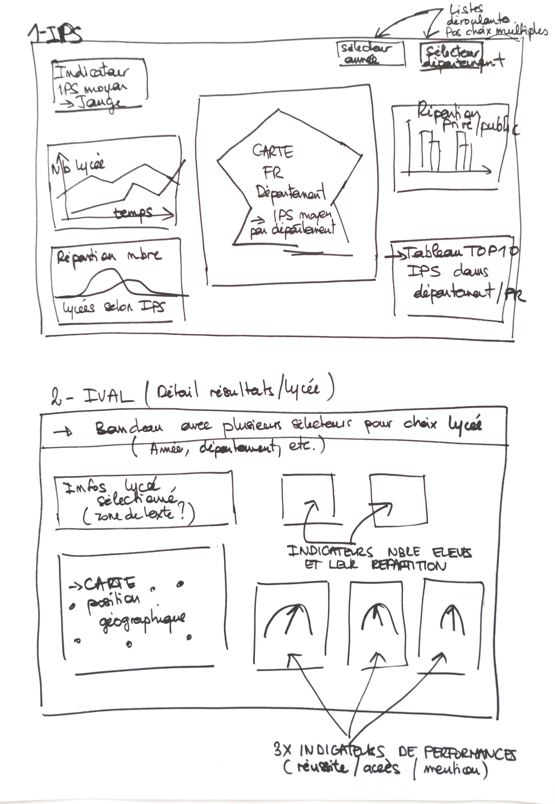
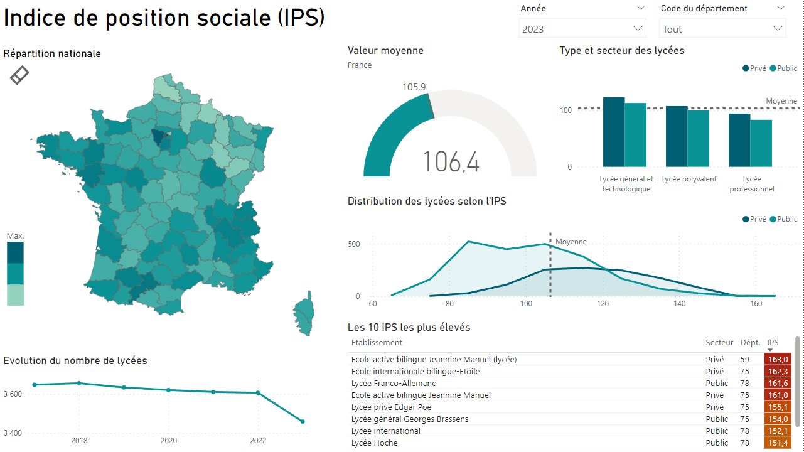
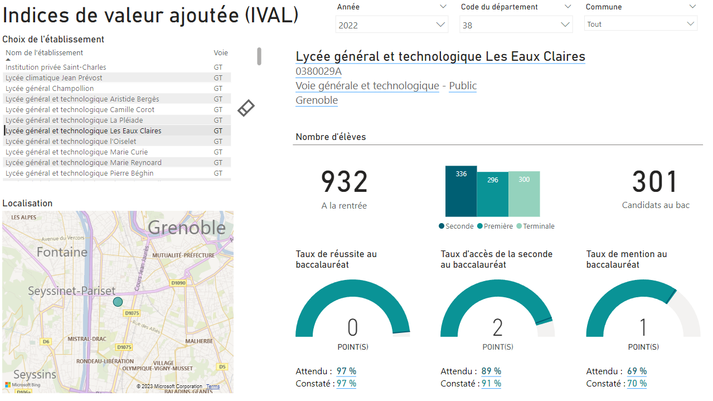
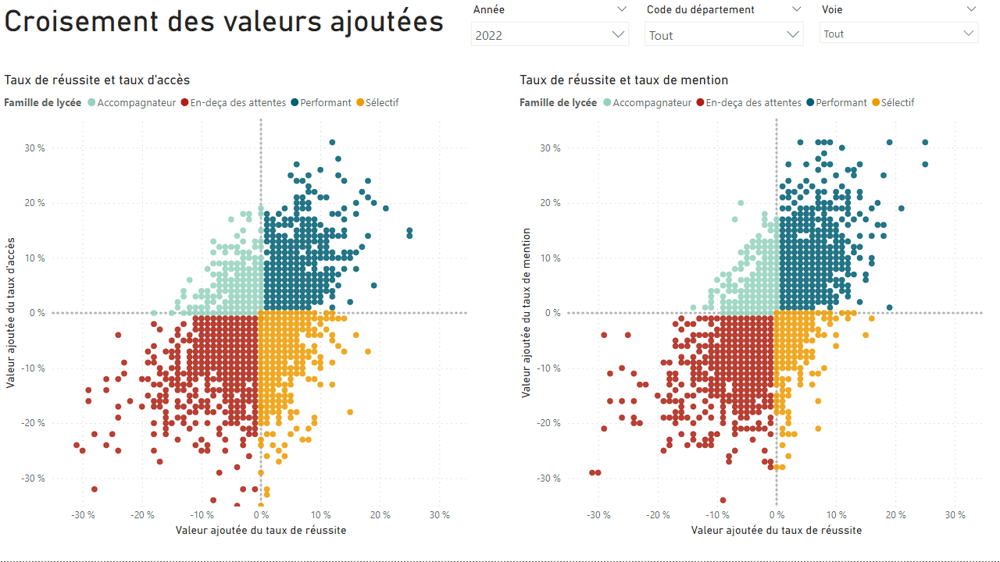
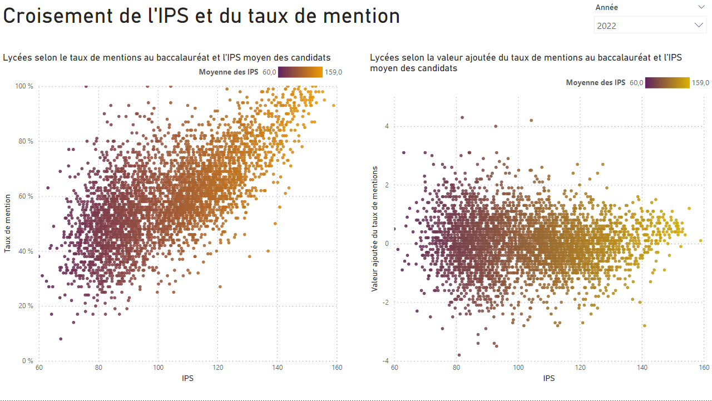

# Présentation projet 8 : Mixité sociale dans les lycées

## Objectif du projet

Réaliser un **tableau de bord** permettant de décrire les **inégalités sociales** entre les lycées à l’aide de **Power BI**.
Pour cela, nous allons :
1. Reprendre et synthétiser les détails essentiels du *dashboard* dans un *blueprint*, sous forme de tableau.
1. Préparer un *mock-up* qui est une version basse fidélité du tableau bord.
1. Prétraiter les données qui seront ensuite utilisées dans Power BI.
1. Créer le tableau de bord.

## Présentation du sujet

### Contexte

* En France, l’**origine sociale** pèse très fortement sur la **réussite scolaire des élèves**.
* Selon le Ministère de l’Education, c’est même l’un des pays de l’OCDE où son impact est particulièrement important.
* Le **manque de mixité est un frein à la réussite** de tous les élèves et à la promesse d’égalité des chances de l’École républicaine.
* L’objectif du gouvernement est de **réduire de 20 % la ségrégation sociale** dans les établissements publics **d’ici à fin 2027**.

### Les indicateurs

Afin d'aider les acteurs du système éducatif, le gouvernement a donc créé deux outils statistiques qui rendent compte et permettent de suivre l'évolution des inégalités et des résultats du système éducatif.

1. L’Indice de Position Sociale (IPS) 
Basé, entre autres, sur la catégorie socioprofessionnelles des parents, il permet de rendre compte des conditions socio-économiques et culturelles des familles des élèves.

1. Les indicateurs de Valeurs Ajoutées des Lycées (IVAL) 
Ils confrontent les résultats de chaque lycée au baccalauréat avec ceux attendus. Ils rendent compte de la performance et de l’accompagnements des établissements.

### Comment lire ces indicateurs

* IPS
    * C’est un « score » compris entre 45 et 185.
    * Plus sa valeur est élevée, plus les conditions familiales sont favorables à l’apprentissage et plus la mixité est faible.
* IVAL
    * Ils sont au nombre de trois : le taux de réussite au baccalauréat, le taux de mention et le taux d’accès de la seconde jusqu’au baccalauréat.
    * Le calcul en valeur ajoutée (taux observé - taux attendu) permet de mesurer l’efficacité propre des lycées.

## *Blueprint*

| Besoins utilisateurs                                                                                | Filtres                                                | Mesures spécifiques à utiliser                                                                                                            | Visualisation                                           | Page     |
|-----------------------------------------------------------------------------------------------------|--------------------------------------------------------|-------------------------------------------------------------------------------------------------------------------------------------------|---------------------------------------------------------|----------|
| Voir la répartition territoriale de l’IPS                                                           | Année                                                  | IPS moyen                                                                                                                                 | Carte de formes                                         | IPS      |
| Avoir l’IPS moyen                                                                                   | Année et territoire (France ou département spécifique) | IPS moyen, IPS médian, IPS minimal, IPS maximal et nom du département sélectionné                                                         | Jauge                                                   | IPS      |
| Se rendre compte des différences d’IPS entre lycées (public/privé et voie générale/professionnelle) | Année et territoire (France ou département spécifique) | Agrégation (moyenne) par type de lycée et par secteur                                                                                     | Diagramme à barres groupé                               | IPS      |
| Comprendre la répartition des lycées (public/privé) en fonction de leur IPS                         | Année et territoire (France ou département spécifique) | Agrégation (somme) du nombre d’établissements regroupés par tranche d’IPS et par type de lycée et indication de la médiane                | Graphique en aire                                       | IPS      |
| Lister les dix établissements ayant les IPS les plus élevés                                         | Année et territoire (France ou département spécifique) | IPS moyen                                                                                                                                 | Table                                                   | IPS      |
| Visualiser l’évolution du nombre d’établissements au cours du temps                                 | Territoire (France ou département spécifique)          | Agrégation (somme) du nombre d’établissements                                                                                             | Graphique en courbe                                     | IPS      |
| Afficher la liste des établissements pour permettre la sélection de l’un d’eux en cliquant dessus   | Année, département et commune.                         |                                                                                                                                           | Table                                                   | IVAL     |
| Voir la localisation géographique du (ou des) établissement(s)                                      | Année, département, commune et établissement           | Agrégation (somme) du nombre d’établissements                                                                                             | Carte géographique                                      | IVAL     |
| Afficher les informations du lycée sélectionné                                                      | Année, département, commune et établissement           | Valeurs sélectionnées pour le nom du lycée, son code, son secteur, sa voie et sa commune                                                  | Zone de texte                                           | IVAL     |
| Avoir les effectifs du lycée à la rentrée                                                           | Année, département, commune et établissement           | Somme des effectifs par année                                                                                                             | Carte                                                   | IVAL     |
| Voir la répartition des effectifs selon les années                                                  | Année, département, commune et établissement           | Effectifs par année                                                                                                                       | Diagramme à barres groupé                               | IVAL     |
| Voir le nombre de candidats au bac                                                                  | Année, département, commune et établissement           | Candidats présents au bac toutes séries                                                                                                   | Carte                                                   | IVAL     |
| Visualiser les valeurs des trois indicateurs suivis                                                 | Année, département, commune et établissement           | Pour les 3 indicateurs et pour le lycée sélectionné : la valeur constatée, la valeur attendue et l’écart (différence constatée/attendue). | Pour les 3 indicateurs : jauge, carte et zone de texte. | IVAL     |
| Classer et visualiser l’action des lycées en fonction de leur taux d’accès                          | Année, département et voie générale ou professionnelle | Regroupement des lycées par famille (calculé à partir des valeurs ajoutées du taux de réussite et du taux d’accès)                        | Nuage de points                                         | IVAL+    |
| Classer et visualiser l’action des lycées en fonction de leur taux de mention                       |                                                        | Regroupement des lycées par famille (calculé à partir des valeurs ajoutées du taux de réussite et du taux de mention)                     | Nuage de points                                         | IVAL+    |
| Visualiser la corrélation entre l’IPS et le taux de mention                                         | Année                                                  | Non concerné                                                                                                                              | Nuage de points                                         | IPSxIVAL |
| Visualiser la corrélation entre l’IPS et la valeur ajoutée du taux de mention                       | Année                                                  | Non concerné                                                                                                                              | Nuage de points                                         | IPSxIVAL |

## Mock-up

 

## Prétraitement des données

Toute la préparation des données a été effectuées dans le *notebook* [`preparation-des-donnees-mixite-sociale-dans-les-lycees`](./preparation-des-donnees-mixite-sociale-dans-les-lycees.ipynb).

## Tableau de bord

Le lien du fichier Power BI, dont les captures d'écran ci-dessous sont issues, est disponible [ici](./rapport-mixite-sociale-dans-les-lycees.pbix).

### Page 1

### Page 2

### Page 3

### Page 4
